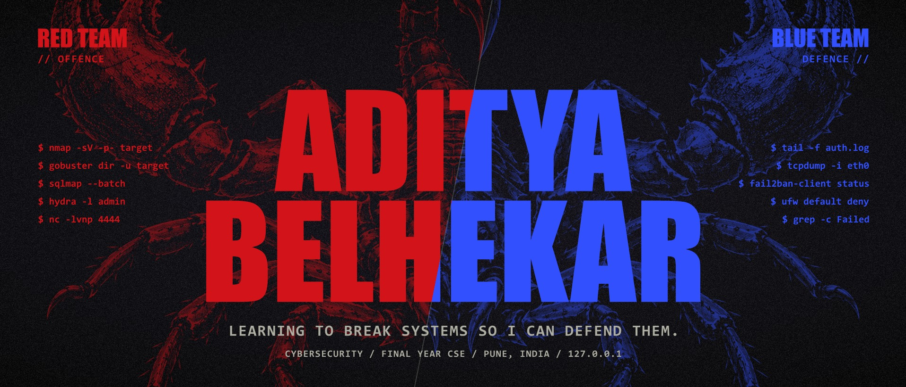
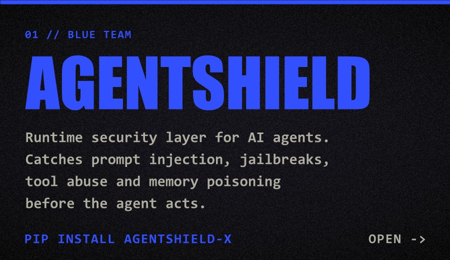
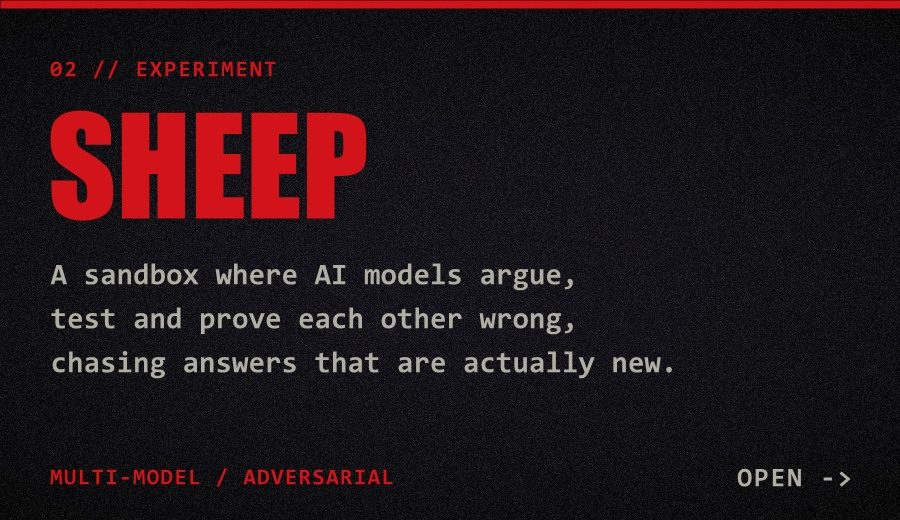

<!-- Images are generated by card.ps1. Edit the text there, re-run it, commit assets/. -->

 

Final year CSE student in Pune, starting again in cybersecurity from zero. I'm learning offence and defence together, because you can't get good at breaking systems without understanding how they're defended.

### `// currently`

- Practising on [TryHackMe](https://tryhackme.com), [Hack The Box](https://www.hackthebox.com) and [OverTheWire](https://overthewire.org/wargames/).
- Back on Kali Linux after a three-month security training in 2025, relearning the tools properly this time.
- Writeups will land here as I finish rooms and boxes.

### `// projects`

- **[AgentShield](https://github.com/AdityaBelhekar/AgentShield)**: started from my own research into how AI agents get exploited. Planned and written with Claude, tested by me. On [PyPI](https://pypi.org/project/agentshield-x/) as `agentshield-x`.
- **[Sheep](https://github.com/AdityaBelhekar/Sheep)**: built with AI assistance.

### `// open to`

Security internships, CTF teams, and anyone willing to point a beginner in the right direction.

### `// contact`

[LinkedIn](https://www.linkedin.com/in/aditya-belhekar/) · [Email](mailto:belhekaraditya96@gmail.com) · [PyPI](https://pypi.org/project/agentshield-x/)
